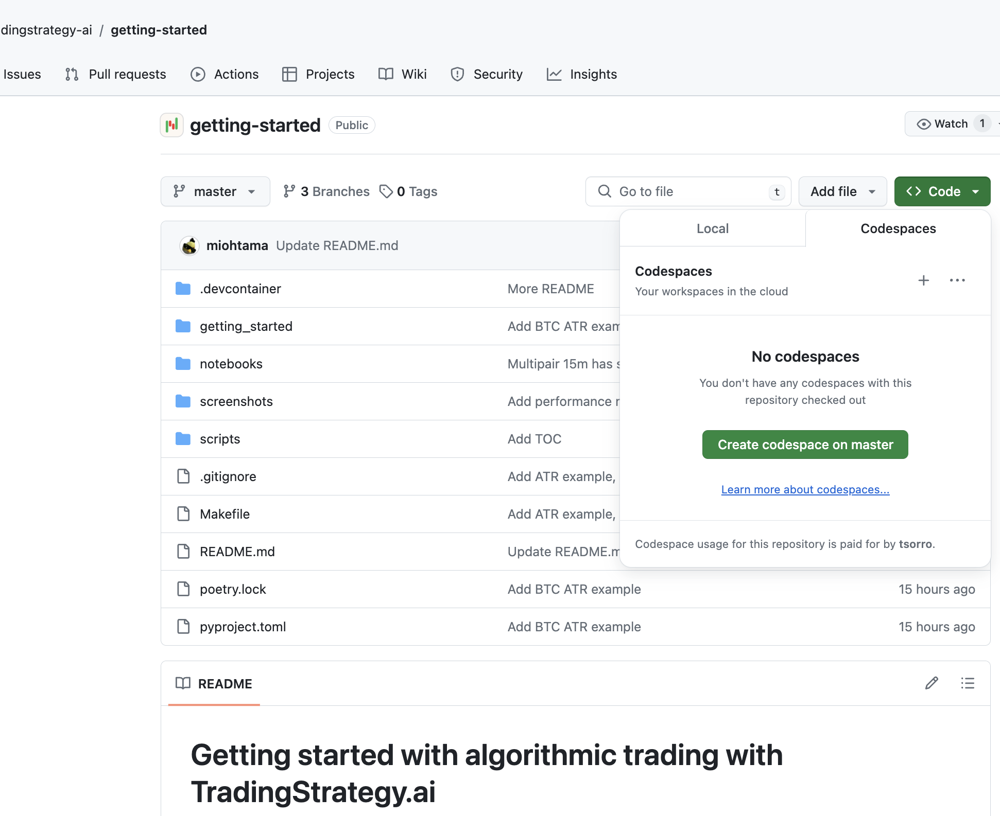
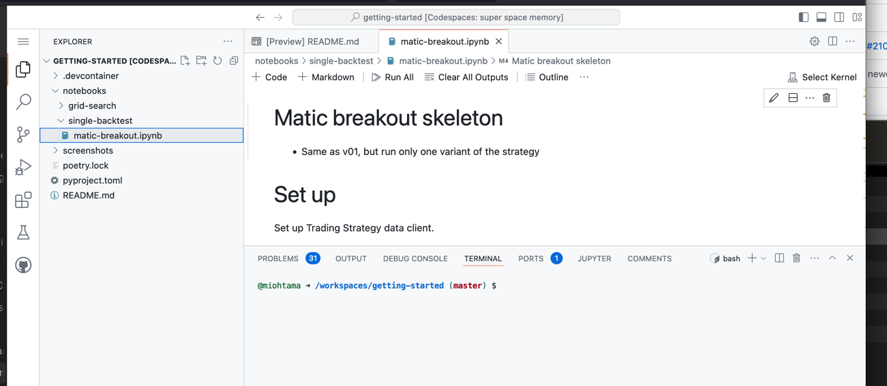
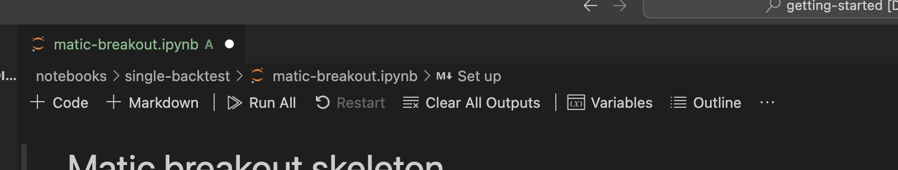
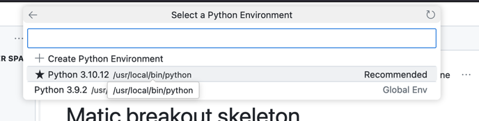
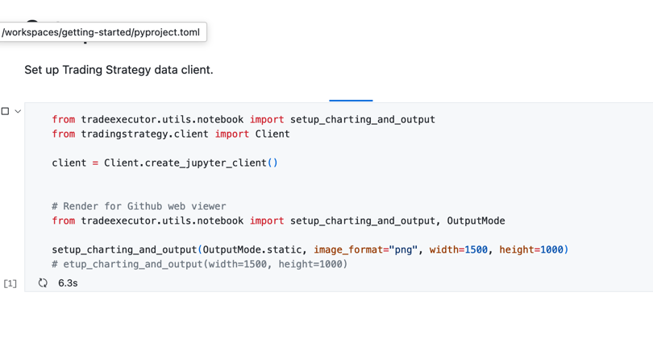
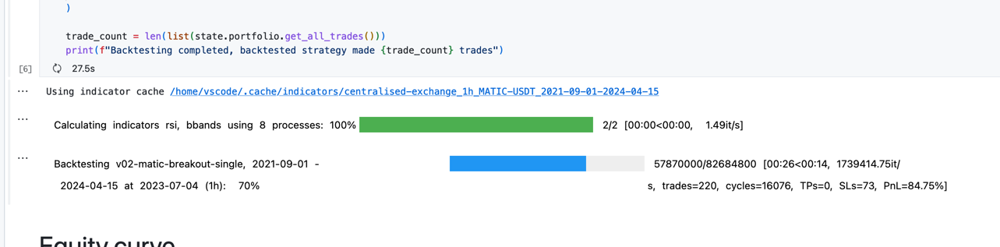
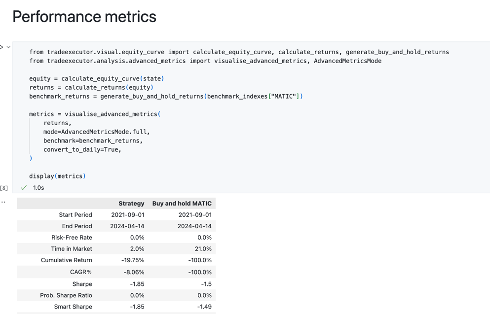
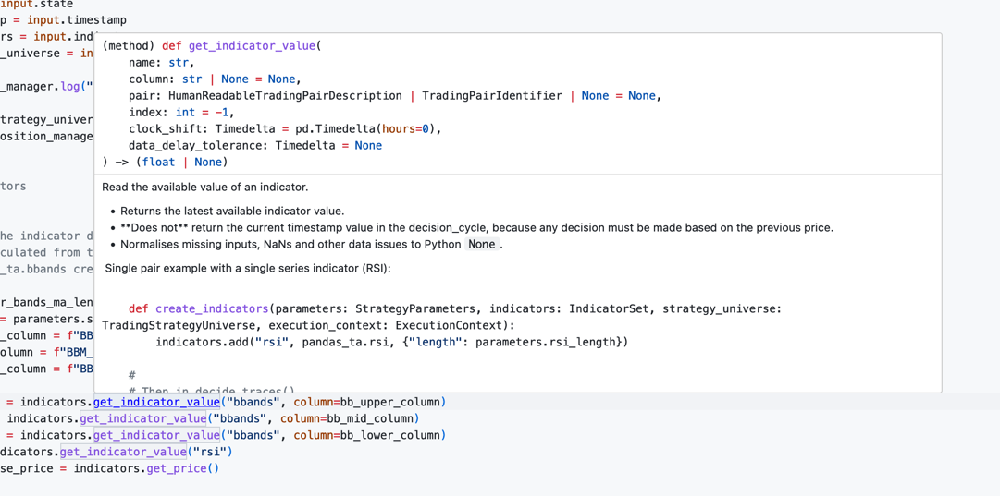

 # Getting started with algorithmic trading with TradingStrategy.ai
 
- This is an example repository for [Trading Strategy framework](https://tradingstrategy.ai) to 
  get started bringing your [algorithmic trading strategy](https://tradingstrategy.ai/glossary/algorithmic-trading) to DEXes and DeFi markets
- This repository contains multiple example backtesting  [notebooks](https://tradingstrategy.ai/glossary/jupyter-notebook) to get started 
- The examples should get you up to the speed how to backtest your strategies on both DEX and [Binance CEX](https://tradingstrategy.ai/glossary/cex) data

- [Prerequisites](#prerequisites)
- [Development environment options](#development-environment-options)
- [Example strategies](#example-strategies)
- [How to run on Github Codespaces](#how-to-run-on-github-codespaces)
- [How to run: local Visual Studio Code](#how-to-run--local-visual-studio-code)
- [Strategy backtest notebook structure](#strategy-backtest-notebook-structure)
- [Grid search skeleton](#grid-search-skeleton)
- [Editing notebook](#editing-notebook)
  * [Tooltips](#tooltips)
- [How to](#how-to)
  * [Develop a trading strategy](#develop-a-trading-strategy)
  * [Add indicators](#add-indicators)
  * [Visualise indicators](#visualise-indicators)
- [Learning resources](#learning-resources)
- [Troubleshooting](#troubleshooting)

# Prerequisites

In order to get started you need

- Github user account 
- Basic Python and data science knowledge
  - Python scripting
  - Pandas
  - Jupyter Notebook
- Basic algorithmic trading knowledge 
  - Understanding price chart and price action
  - Technical indicators

# Development environment options

You can either run and edit these examples 

- In cloud, in your web browser, using Github Codespaces (very simple, but slower)
- Locally using Visual Studio Code (faster, but more expertise required)
- Any Python editor you wish (super fast, tailored to your flavour, but senior Python expertise required)

# Example strategies

You can find these example strategy backtests.

Strategies are backtested 2022-2024/H2 as this gives nice bear market drawdown and then walk back up.

Individual backtests:

- [MATIC: An RSI and Bollinger bands breakout strategy for MATIC using Binance CEX data](./notebooks/single-backtest/matic-breakout.ipynb)
  - Easy complexity
  - 1h timeframe  
- [BTC: An ATR-based breakout strategy for BTC using Binance CEX data](./notebooks/single-backtest/bitcoin-atr-breakout.ipynb)
  - Average complexity
  - 15m timeframe
  - Adds a [market regime filter](https://tradingstrategy.ai/glossary/market-regime) based on daily ADX indicator 
- [Multipair 15m: An ATR-based multipair breakout strategy using Binance CEX data](./notebooks/single-backtest/multipair-atr-breakout.ipynb)
  - Same as above
  - Trades all BTC, ETH and MATIC all in a single strategy
- [Multipair 1h: An ATR-based multipair breakout strategy using Binance CEX data](./notebooks/single-backtest/multipair-atr-breakout-slow.ipynb)
  - Same as above
  - Instead of trading 15 minutes timeframe, trade 1h timeframe with 24h point of interest window

Grid searches:

- TODO

# How to run on Github Codespaces

In this tutorial, we open a single backtes in Github Codespaces and run it. You can do all in your 
web browser using your Github account, no software is needed.

Press **Create codespaces** on [Github repository page](https://github.com/tradingstrategy-ai/getting-started).



This will give you a page showing your codespace is being launched.


After a while your Github Codespaces cloud environment is set up. The first launch is going to take a minute or two.



In the file explorer on the left, open a notebook: `notebooks/single-backtest/matic-breakout.ipynb`. 

After opening the notebook click **Clear all Outputs** and then **Run all** button Jupyter toolbar.



When you are asked to *Select kernel*. Choose *Python Environments..* and then `/usr/local/bin/python`.



You should see now notebook running, indicated by the progress indicator and run time count down in each notebook cell.



After the notebook is running successfully, you should be able to press **Go to** on the toolbar and see the backtesting progress bar going on. 
You will see a separate progress bar for 1) downloading data (done only once) 2) calculating technical indicators 3) running the backtest.



**Note**: If you see a text `"Error rendering output item using 'jupyter-ipywidget-renderer. this is undefined.` it means Visual Studio Code/Github Codespaces has encountered an internal bug.
In this case press **Interrupt** on a toolbar, close the notebook, open it again and press **Run all** again. It happens only on the first run.

Shortly after this backtests results are available.

You can find them by scrolling down to the different sections

- Equity curve
- Performance metrics
- otheres



And now you are done with our first backtest! Continue below to learn more how you can get started with your own strategies.

# How to run: local Visual Studio Code

This is an alternative for Github Codespaces that runs on your local computer (fast).

- Check out [this Github repository](https://github.com/tradingstrategy-ai/getting-started) to your local computer
- Open the checked out folder in your Visual Studio Code
- Visual Studio code should prompt you "Do you wish to run this in Dev Container"
- Choose yes
- Follow the same steps as in *How to run on Github Codespaces* above 

**Note**: If you run on a local sometimes the Jupyter Notebook toolbar does not appear with **Run all** etc. buttons. Often Visual Studio Code fails to automatically install its extensions on the first run: in this case you need to restart your Visual Studio Code and reopen the notebook.

# How to run: Your own Python environment

For seniors, with full source code checkout:

```shell
make trade-executor-clone  # Git clone with submodules
poetry shell
poetry install
```

# Strategy backtest notebook structure

Each strategy backtest notebook will consist of following phases. 

- **Set up**: Create Trading Strategy client that will download and cache any data
- **Parameters**: Define parameters for your strategy in `Parameters` Python class
- **Trading pairs and market data**: Define trading pairs your strategy will use and method to construct a trading universe using `create_trading_universe()` Python function.
  This function will take your trading pairs and additional information (candle time frame, stop loss, needed lending rates) and construct Python dataset suitable for 
  backtesting. See documentation.
- **Indicators**: In this phase, you have `create_indicators` function. You define indicator names, parameters and functions for your strategy.
  Indicators are defined as a separate step, as indicator calculation is performed only once and cached for the subsequent runs.
  See documentation.
- **Trading algorithm**. Here you define `decide_trades` function that contains the trading strategy logic.
  It reads price data and indicator values for the current `timestamp` of the decision cycle. Then it outputs a list of trades.
  Trades are generic by `PositionManager` of which functions `open_position` and `close_position` are used to open individual trading positions.
- **Backtest**: This section of the notebook runs the backtest. Here is a progress bar displayed about the current running backtest,
  and any errors you may encounter. We use function `run_backtest_inline()` that gives us the backtest's `state` Python object,
  which contains all the information about the backtest execution we can then analyse.
- **Output**: You can have various visualisation and tables about the strategy performance. These include e.g. **Equity curve**,
  **Performance metrics** (max drawdown, Sharpe, etc) and **Trading statistics**.

This is a rough skeleton. You mix and match can easily add your own trading signals and output charts using with all tools available in Pandas and Jupyter notebook ecosystem.
There aren't any limitations on what you can do.

# Grid search skeleton

The grid search is the same invididual backtest with very minimal changes
- **Parameters** class has single parameter values replaced with Python lists to explore all the list combinations in the grid search
- **Backtest** runs `perform_grid_search` instead of `run_backtest_inline`
- **Output** shows summaries backtest results and heatmaps

Grid search are taxing on a computer, so we recommend running grid searches only on local powerful computers.

# Editing notebook

You can edit the backtest notebook

- Edit any changes
- Press **Clear output**
- Press **Run all** to rerun everything

## Tooltips

Any function will give it's Python documentation as a tooltip on mouse hover.



# How to

Some questions on how to get things done.

## Develop a trading strategy
 
- Have a trading idea
- Create the first prototype with data sources and indicators using centralised exchange data like Binance
  - Decentralised market have often too little history to make any kind of analysis
  - You can use streamlined tools like TradingView for the first iterations
  - Then convert your strategy skeleton to Python code
- Check the robustness of the strategy
   - After you are happy with the initial strategy version you can perform some robustness tests
   - Validate your backtest robustness by testing shifting timeframes around
- After happy with the strategy, Change the backtesting to real decentralised data
  - Convert the backtest notebook to a Trading Strategy Python module
- Launch the live trading strategy using Trading Strategy oracle on DEXes
- Add a vault like Enzyme so that others can deposit into your strategy

## Add indicators

TODO

## Visualise indicators

TODO

# Learning resources

- [Learn algorithmic trading](https://tradingstrategy.ai/docs/learn/index.html#learning)
- [Trading Strategy documentation](https://tradingstrategy.ai/docs/)
- [About Github Codespaces](https://github.com/features/codespaces)
- [About Visual Studio Dev Containers](https://code.visualstudio.com/docs/devcontainers/containers)

# Troubleshooting

**Note to Mac users**: The current Docker image is built for Intel platform. If you run Dev Container
on your Mac computer with Visual Studio Code, the backtesting speed is slower than you would get otherwise. 

- [Rebuilding Dev Containers for Github codespaces](https://docs.github.com/en/codespaces/developing-in-a-codespace/rebuilding-the-container-in-a-codespace)
- [Dev Container CLI](https://code.visualstudio.com/docs/devcontainers/devcontainer-cli)
- [Microsoft default Dev Container image for Python](https://github.com/devcontainers/images/tree/main/src/python)
- [Dev Container Github Action](https://github.com/devcontainers/ci/blob/main/docs/github-action.md)
- [Dev Container JSON reference](https://code.visualstudio.com/docs/devcontainers/create-dev-container)

Testing the Dev Container build:

```shell
devcontainer up --workspace-folder . 
```

Checking installed packages wihtin Codespaces terminal:

```shell
pip list
```

Running the example notebooks using command line `ipython` (useful for debugging)

```shell
ipython notebooks/single-backtest/bitcoin-breakout-atr.ipynb
```